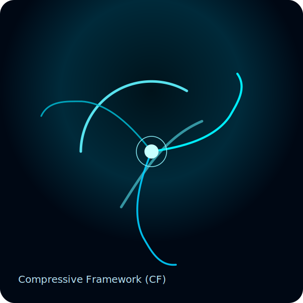

# Compressive Framework (CF)

  

**Compressive Framework** — *Theoretical Gravitation & Particle Studies*.

The CF project investigates how compressive geometry and harmonic structure shape particle behavior in high-curvature regimes.  
This documentation provides:

- Theory notes and symbolic prototypes  
- Reproducible simulations and runnable notebooks  
- Reference plots and interactive visualizations

---

## Quick start

- View interactive notebooks: **Notebooks → Introduction**  
- Run the browser demo: **Simulations → Interactive**  
- Read the math: **Theory → Equations**

---

## Math examples

Inline math works: $C(x) = \nabla \cdot \mathbf{g}(x)$

Block math example:

$$
\Psi(x,t) = A \sin(kx - \omega t)\, e^{-\alpha x}
$$

---

## Contributing

See the [Contribution Guide](contributing.md) for how to run the notebooks and contribute safely.
